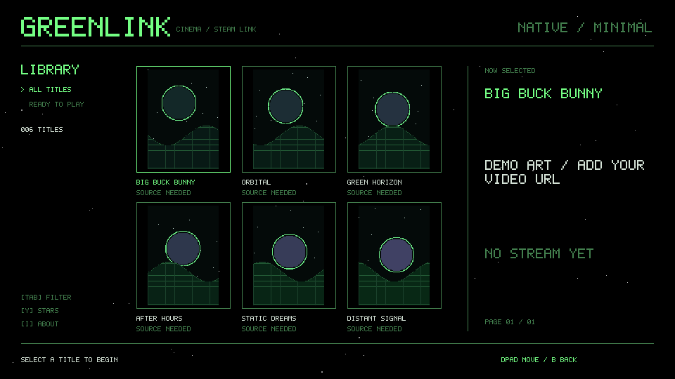

# FlXtR-Steamlink

A tiny native movie-library shell: black background, green pixel text, poster art,
and a sparse white starfield inspired by old emulator menus.

This is an **early prototype**. Native movie/series browsing, search, seasons,
episodes, server lookup and direct playback run on the box. Selecting a title
fetches its actual servers; selecting a server resolves a fresh playback link.
Quality choices come from the source's HLS master playlist when available.
No browser, Node, Python, or Docker runs on the box. WSL/Docker are build tools.



## PSP device-test beta

`bash scripts/autocompile --psp` builds a separate native EBOOT using the existing
`garden-gaiden-psp-sdk` Docker image. It includes direct MP4 range streaming,
firmware AVC/AAC decoding, a text menu and PSP-specific update support.
It has not been tested on a PSP or emulator; KissAnime/HLS and the full catalog
UI are not ported yet. See [PSP installation and test status](docs/PSP-STATUS.md).

## Footprint

- C99 + the Steam Link's existing SDL2 library; built-in 5x7 pixel font.
- Six cached poster textures, each at most 192x288. BMP files only; pre-size posters
  before deployment. Decoded poster texture pixels total at most 1.27 MiB.
- At most six entries per online page; local direct-URL catalogs accept 128 rows.
- A separate short-lived C worker fetches metadata and six bounded JPEG posters,
  using the firmware's curl, json-c and SDL2_image. The library stays responsive;
  B cancels loading. A large metadata snapshot is scanned from disk, not kept in RAM.
- The native resolver is approximately 285 KB. Its response decoder is compiled
  to ARM from the site's pinned WebAssembly client module at build time, with
  bounded C host bindings. No JS engine or WASM interpreter runs on the box.
- 56 white stars, capped to approximately 30 updates/sec. Toggle them off to draw
  only when state changes. Actual total RSS includes SDL and graphics driver memory.
- The separate player uses FFmpeg libraries for HLS/MP4 demuxing and audio, and
  Valve **SLVideo** for hardware H.264 decoding. It selects normal mode for B-frames.

## Controls

| Action | Controller | Keyboard |
|---|---|---|
| Move | D-pad | Arrow keys |
| Play | A | Enter |
| Stop / back / exit | B | Escape |
| Local / movies / series | X | F2 |
| Search movies or series | Start | / or F3 |
| Type in search | D-pad + A | Keyboard |
| Submit search | Start or the > key | Enter |
| Delete search character | B or the < key | Backspace |
| Next / previous catalog page | Move beyond grid edge | Page Down / Page Up |
| All / playable filter in local catalog | — | Tab |
| Toggle stars | Y | Y |
| About outside movie/series root | Start | I |
| Select viewing mode in library | LB / RB | V |
| Cycle viewing mode during playback | Y / LB / RB / Start | Controller required |

Launching a movie releases the library's graphics layer completely. Stopping it
recreates the library at the same selection. Viewing modes are fullscreen fit
(preserve aspect ratio), stretch (fill display), and centered 1:1 source pixels.
1:1 is unavailable when the source is larger than the display. A small mode label
appears for 2.5 seconds after switching, then disappears.

Viewing modes use an optional Marvell viewport adapter because SLVideo has no
public video-rectangle API. It captures the live handle from SLVideo's existing
viewport call, verifies rectangle readback, and restores the original viewport on
exit. It uses no private object offsets. This is experimental: rectangle acceptance
does not establish visual scaling on every firmware. Unsupported modes report
`VIEW MODE UNAVAILABLE`. Keyboard events during playback are unavailable while
the library's video subsystem is released; controller input remains active.

The player supports buffered seeking, pause and embedded text subtitles through the in-video menu described below. A successful frame-submission test does not establish lip-sync accuracy on every stream.

Press X to choose Series, A on a show, then A on a season and episode. B retraces
those screens and restores the previous selection. Source choices show a compact
server/quality list. Unavailable servers leave you in the server list to choose
another. Selecting a title never substitutes a different episode or a demo video.
Single-quality sources show AUTO. Master playlists expose compatible quality
choices up to 1080p. Playback retains the master playlist for separate audio
groups and selects the requested H.264 height, discarding other tracks.

## Build the shell

Run in a WSL Linux shell with Docker access:

```sh
docker build -t greenlink-sdk .
docker run --rm -v "$PWD:/src" greenlink-sdk
```

An existing image with Valve's SDK at `/opt/steamlink-sdk` also works:

```sh
docker run --rm -v "$PWD:/src" -w /src steamlink-sdk-wsl bash scripts/build-steamlink.sh
```

Output: `dist/greenlink.tgz` and `dist/steamlink/apps/greenlink/`.

### One-command rebuild inside Docker

The Dockerfile installs `/usr/local/bin/autocompile`. To add it to an existing SDK
container, copy `scripts/autocompile` there and run `chmod 755` on that file.

```sh
autocompile               # update main, build player, resolver and shell, package
autocompile --shell-only  # rebuild UI/catalog; retain built player and resolver
autocompile --no-update   # build local changes without fetching
```

The default checkout is `/opt/FlXtR-Steamlink`; output is
`/opt/FlXtR-Steamlink/dist/greenlink.tgz`. FFmpeg is cached in
`/var/cache/flxtr-steamlink`. Updates refuse to overwrite local changes.
This command builds only; it stores no SSH credentials and does not interrupt the box.

## Build the player

```sh
docker run --rm -v "$PWD:/src" -w /src greenlink-sdk bash scripts/build-player.sh
docker run --rm -v "$PWD:/src" -w /src greenlink-sdk bash scripts/build-resolver.sh
docker run --rm -v "$PWD:/src" -w /src greenlink-sdk bash scripts/build-steamlink.sh
```

FFmpeg 4.4.5 is pinned for the old Valve SDK toolchain; download SHA-256 is checked.
The build enables a restricted set of codecs/protocols and uses the firmware's
GnuTLS library with certificate verification enabled. The package includes a
SHA-256-pinned Mozilla CA bundle from curl (2026-09-25, MPL 2.0) because the old
firmware certificate store cannot validate the current poster CDN. The app uses
its own bundle; it does not modify system trust or disable verification.
This legacy dependency needs
an update/security review before treating the application as production-ready.
Build-cache persistence is optional via `GREENLINK_BUILD_CACHE` and a Docker mount.
FFmpeg compilation uses four jobs by default; override `JOBS` if needed.

The resolver build uses CMake and host g++ to build pinned WABT 1.0.36, then
translates a SHA-256-pinned upstream decoder module to C and cross-compiles it.
Unknown imports or changed downloads fail the build. Downloaded modules and
generated code stay in the build cache; they are not committed to this repository.

## Install

Copy the `dist/steamlink` folder onto a FAT32 USB drive, insert it into the Steam
Link, then power-cycle it. The FlXtR Steamlink entry appears in the native menu. Existing
firmware and other apps are not replaced.

Alternatively, extract `dist/greenlink.tgz` under `/home/apps` over an authenticated
SSH session. Exit a running Moonlight/Steam session before testing video output.

## Catalog

`catalog.tsv` has four tab-separated fields per line:

```text
TITLE<TAB>METADATA<TAB>RELATIVE POSTER BMP PATH<TAB>DIRECT HTTP(S) VIDEO URL
```

An empty URL shows `SOURCE NEEDED`. The sample catalog contains original procedural
art and empty playback URLs, not a scraped movie collection. Add a working direct
URL for local playback, or press X to browse the online Movies/Series libraries.
Use `catalog.local.tsv` for private or temporary URLs (excluded from Git), and launch
`./greenlink --catalog catalog.local.tsv`. Playback URLs may expire.
The menu launcher automatically uses `catalog.local.tsv` when it exists. This
private catalog is excluded from Git and should be preserved during updates.

### Movie and series listings

The native worker talks directly to the site's public metadata API. With no
snapshot installed it fetches popular listings on demand. Search always queries
the API; season and episode details also load on demand, including season 0.

To cache both popular lists on disk, run on your build machine:

```sh
python3 tools/crawl_catalog.py --cache /tmp/flxtr-metadata --output library.local.tsv
```

Copy `library.local.tsv` into the installed app directory. The crawler resumes
cached pages, deduplicates IDs, and issues at most two requests per second. It
collects metadata only. The upstream endpoint caps each list at 500 pages even
though it reports more pages; this is not a complete index of every playable title.
Search can find entries outside those popular lists. Metadata and artwork are
provided by TMDB through the site's metadata service; FlXtR is not endorsed or
certified by TMDB.

### Multiple sources

With the resolver installed, sources are fetched on demand directly from the site.
The server list is deduplicated and sorted, and resolving a server generates fresh
signed requests. No account password, PC helper, or pre-crawled media URL is needed.
An unavailable server can be retried or replaced using B to return to the list.

For builds without the resolver, private `sources.local.tsv` rows provide an
offline source list with seven tab-separated fields:

```text
TMDB_ID<TAB>SEASON<TAB>EPISODE<TAB>movie|tv<TAB>SERVER LABEL<TAB>QUALITY LABEL<TAB>DIRECT URL
```

Movies use season/episode `0 / 0`; TV uses actual season and episode numbers.
Multiple rows provide selectable servers or quality variants for that exact title.
These are supplied URLs, not automatically extracted servers or HLS renditions.
The verified local test link remains separate from this public repository.
`catalog.local.tsv`, `library.local.tsv`, `sources.local.tsv` and `catalog-cache/`
are ignored by Git and preserved across package updates.

## Desktop tests

Install a C compiler, Python 3, pkg-config, and SDL2, SDL2_image, curl and json-c
development files, then:

```sh
make test
./build/greenlink
./build/greenlink --no-stars
```

`--screenshot file.bmp` renders one frame; `--frames N` exits after N rendered
frames. `SDL_VIDEODRIVER=dummy` allows headless shell tests.

## Research and remaining work

See [RESEARCH.md](RESEARCH.md). The native resolver has fetched fresh movie and TV
episode links on the Steam Link, and the native player probed both successfully.
This is not a guarantee that every title/server is available or compatible.
No passwords, generated upstream module code, or playback links are committed.

The controller flow is title, season/episode for TV, then automatic playback.
The shell tries each returned server once, skipping failed lookups and retrying
when the player exits with an error. It selects the best compatible H.264 stream
up to the saved quality limit (720p by default), without server or quality menus. B cancels lookup or stops playback
without retrying; normal completion returns to the original library selection.
If every server fails, A retries the title. A playback error after video has begun
may restart the title on another server; playback positions are not preserved.
The application operates with the PC off. Provider changes, expiring links,
unsupported codecs and failed servers remain possible. Persistent resume bookmarks and automatic next-episode playback are not implemented yet.

## Licensing

Original Greenlink code and procedural artwork: MIT. Valve SDK/system libraries
retain their licenses. FFmpeg is configured without GPL/nonfree components and is
LGPL 2.1-or-later; static binary redistribution requires its corresponding source,
license notices and relinkable application object files. Build scripts download
FFmpeg from its official upstream. Do not publish player binaries without those
materials; source-only publication is separate from binary distribution.
The compiled resolver includes the Apache-2.0 WABT runtime; its license is included
in the local package. The upstream decoder is fetched from its original host at
build time. This repository publishes original source and build scripts, not
upstream module files. Public shell-only releases exclude the player and resolver.


## Coverflow and shell updates

The library now opens in a lightweight coverflow view: left/right selects covers,
up/down changes pages. SELECT (keyboard F5) opens Settings, where Library View switches between
coverflow and the optional six-cover wall. Six poster textures stay in memory; depth and reflections use SDL2.
Playback still releases the menu's graphics resources before opening video.

The installed launcher checks the latest public GitHub shell release at startup.
It uses verified HTTPS, a required SHA-256, a bounded download and an executable
version check before an atomic replacement. No GitHub token is stored on the box.
Offline or invalid updates leave the existing executable installed. The previous
shell remains at `greenlink.previous`; catalogs, player and resolver are untouched.
To check manually, open ABOUT (START in LOCAL), then A; keyboard U works from the
library. A successful check restarts the shell. Create `.no-auto-update` in the app
directory to disable startup checks. Interrupted updates can leave `.update-lock`;
remove that empty directory only after confirming no updater is running.

The updater/launcher must first be installed through the normal local package or
SSH deployment. These shell-only releases update an existing installation, not a
bare Steam Link. Future changes to helpers or the updater itself need a local
package deployment. To roll back, disable startup checks and copy
`greenlink.previous` to `greenlink.restore`, chmod 755 it, then rename it to
`greenlink` while the app is closed.

Inside the SDK Docker container:

```sh
autocompile --shell-only --publish
```

Publication requires `GH_TOKEN` in the build environment or a token passed on stdin.
The script requires a clean checkout and a matching build manifest. It creates an
immutable commit-tagged draft release, uploads `greenlink` and
`shell-manifest.txt`, then publishes it as latest only after both uploads succeed.
A failed upload leaves a draft for inspection; existing releases are not overwritten.
The public executable is only the original SDL2 shell, dynamically linked to system
SDL2. FFmpeg/player and decoder/resolver binaries remain local.


## Library cache and controller sleep

Three on-disk JSON page slots retain metadata and up to eighteen small BMP covers
(roughly 4 MiB at the maximum poster dimensions). Upcoming pages prefetch in a
separate worker; navigation cancels prefetch so the requested page takes priority.
Only six textures are decoded by the shell at once. Cache keys distinguish
library, search, series/season and page, include the local catalog timestamp and
size, and expire after 24 hours. Incomplete caches rebuild automatically. Playback
URLs and server results are never cached by this layer.

After five minutes without controller button/meaningful stick activity, the app
asks BlueZ to disconnect connected Bluetooth DS4 controllers (Sony 05c4/09cc).
This releases their Bluetooth connection so they can power down. Press PS to
reconnect. The timer also runs during playback. Other controllers, USB devices,
Bluetooth keyboards and the adapter itself are not disconnected. Physical power
state depends on controller firmware; the app does not unpair the controller.


The player now includes AAC/LATM, MP2/MP3, AC3/EAC3, DTS, Opus, Vorbis,
FLAC and 16/24-bit PCM audio decoders. It selects a decodable track associated
with the video, downmixes to stereo, and rejects sources with no usable audio.
If video is running but no audio samples decode within 20 seconds, it exits with
an error so automatic server fallback can continue. This cannot detect an audio
track whose encoded samples are themselves silent.


## Playback buffer and subtitle settings

SELECT / F5 opens persistent Settings. Defaults are 720p, a 15-second prebuffer,
a 128 MiB disk limit, coverflow and subtitles off. Available limits are
480/720/1080p, 5/15/30 seconds and 64/128/256 MiB. A source with no compatible
video at or below the chosen resolution is skipped; there is no transcoding.

A network demux thread reads ahead into a bounded rolling file under
`playback-cache`. Compressed packets and their side data are read from disk by
the hardware player. The file is immediately unlinked but stays open during
playback, so stopping, crashing or changing server releases it automatically.
This is a temporary playback buffer, not a saved playable movie download.
The player requires the selected buffer capacity plus 32 MiB of free space.
It waits for the selected prebuffer duration (or EOF/full buffer), and re-fills
if the queue empties. A slow server can still exhaust the buffer. Seeking reopens
and prebuffers at a keyframe. Metadata and at most one packet per worker stay in RAM;
the compressed read-ahead payload stays on disk.

Subtitle settings: Off, Automatic, English or Norwegian; Normal/Large text;
and -5 to +5 seconds delay (positive delays subtitle display). Text tracks included
in the stream are decoded (SubRip, WebVTT, mov_text and ASS/SSA) and shown in an
SLVideo overlay. Separate subtitle URLs from the provider are not resolved yet.
Bitmap subtitles, full ASS styling and non-ASCII glyphs are not supported; unknown
characters display as question marks. Settings apply to the next playback.

`greenlink-player --probe-buffer URL` checks demux and disk-buffer operation on
the device without claiming the display/audio hardware. Host tests additionally
need the libavformat/libavcodec/libavutil development packages.


## KissAnime library

X cycles LOCAL / MOVIES / SERIES / KISSANIME. START searches the selected
catalog; A opens an anime's episode list, then starts automatic SUB/DUB source
lookup. Episodes are sorted in ascending order. This adapter runs entirely on
the Steam Link using bounded HTML requests, the existing three-page JSON cache
and resized poster thumbnails. The anime directory exposes next-page links,
so its displayed title count is a lower bound marked with `+`.

KissAnime currently embeds GogoAnime/MegaPlay. The native adapter follows those
known embed hosts with the parent referral header, requests MegaPlay's public
source endpoint, decodes its encrypted JSON response, and creates the short-lived
CDN token used by the site's player. No downloaded JavaScript is executed.
Source URLs are resolved afresh on playback and on seek/quality restarts rather
than cached. The player supplies the required referral header and accepts this
host's MPEG-TS segments named `.jpg`, retaining the network protocol restrictions.

The earlier file-unavailable diagnosis was incorrect: MegaPlay returned an error
page when the referral header was missing. Live checks on 2026-10-08 resolved
One Piece episode 1180 through the native catalog and FFmpeg detected H.264/AAC
at 1080p, 720p and 480p. The 720p default still applies. Hardware playback of this
fix is not yet verified; the Steam Link was unreachable during testing. Provider
protocol changes can require adapter updates. Sub/Dub are language choices, not
two independent servers. The alternate clone domains are not integrated.

## In-video controls

With the matching player installed, Options/Start opens a black/green hardware overlay. D-pad selects controls; Cross/A changes them; Circle/B closes the menu (or stops playback when the menu is closed). L1/R1 or left/right outside the menu skip ten seconds backward/forward. Seeking is a keyframe seek, not reverse video playback: the player reopens the same stream at the requested timestamp, resets hardware/audio state, and refills the configured disk buffer. Unsupported seeking returns to the library with an error rather than silently starting at zero.

The menu includes pause/resume, subtitle language/off, size and offset, fit/stretch/1:1, 480/720/1080p limit, next server, and previous/next episode. Episode navigation crosses catalog pages within the current season; it does not cross seasons. Server and episode actions are disabled for local videos. Subtitle language and quality changes reopen and rebuffer at the current position; a server must expose a compatible track. Embedded text subtitles only are supported. Quality is a stream-selection limit, not transcoding. Pause stops feeding video and pauses audio; already queued hardware frames can briefly drain.

Shell-only GitHub updates remain compatible with the previous player; the complete local package installs `player-menu-v1` alongside the new player to enable these controls. See [ROADMAP.md](ROADMAP.md) for the future optional-dub investigation.

## White metallic theme

The library uses a generated silver-white water-drop background, dark green accents and charcoal text. One 960×540 texture uses approximately 2 MiB at 32-bit texture depth and is freed before playback. The background is static; stars do not animate over it. The full local package contains the asset; shell-only updates on older installations retain the dark fallback until `assets/white-metal-droplets.bmp` is installed. Generation details and prompt are in [assets/BACKGROUND.md](assets/BACKGROUND.md).

## Internet Archive videos

Press X to cycle to ARCHIVE; Start searches public video items. Open an item with A, choose a video file, then A plays it through the existing hardware player and disk buffer. Only public MP4 candidates labelled H.264 or MPEG4 are listed; audio, books, pictures and private files are excluded. A format label is not a codec guarantee: the player still requires compatible H.264 video at the chosen resolution and decodable audio. Some indexed items have no matching files or unavailable downloads. This does not bypass restricted items.

Uses the public Advanced Search and metadata APIs directly on the Steam Link, without a PC or API key. Six items per page use the existing three-page JSON cache. Public item/download URLs are retained in this cache; provider stream URLs remain uncached. `--library archive` opens this library directly.

KissAnime status: native MegaPlay source resolution and desktop FFmpeg media probing pass; Steam Link hardware playback still needs verification. See the KissAnime library section above.

## Scheduled TV mode

Press X to reach TV MODE, then A to start continuous episode playback. The schedule uses Oslo time, including daylight saving. It is a personal scheduled playlist, not live broadcasts or a wall-clock seek into an already-running channel. Start begins a full episode; each episode finishes before the current clock selects the next genre block.

| Hours | Default genre |
|---|---|
| 00-06 | Sci-fi |
| 06-10 | Animation |
| 10-15 | Comedy |
| 15-17 | Crime / detective / drama |
| 17-19 | Action / adventure |
| 19-22 | Alternating sci-fi and Adult Swim animation |
| 22-24 | Mystery |

Settings > TV Schedule edits all seven blocks. Up/down selects a row, A switches between start hour and genre, left/right changes the selected value, and B saves and returns. The midnight start is fixed; other starts stay between neighboring rows so every hour belongs to one block. Change a block's genre to Mixed Shows for a general lineup. Settings persist in `settings.cfg`.

TV mode discovers shows by TMDB genre (and Adult Swim network for that evening choice), selects the next episode remembered for each show, and uses the existing automatic server retries. Completed episodes update bounded `tv-progress.tsv` history; failures and explicit stops do not. If twelve show attempts fail, TV mode stops instead of retrying indefinitely. B closes the playback menu; B outside it stops TV mode. Sources still depend on the provider; a matching show is not a guarantee of playable media. Internet Archive remains a separate video library.


### TV rotation, commercials and browse filters

TV selection persists its cursor and the last 32 selected episodes in `tv-sequence.txt` and `tv-recent.tsv`. It avoids the last six selected shows, excludes recently attempted episodes, and browses up to ten popular-result pages (two for Adult Swim). Selection is recorded before playback; episode progress advances only after successful completion.

Settings > TV Commercials enables a rotating Internet Archive commercial between completed programs (on by default). The initial rotation has three curated vintage ads: Kellogg's Frosted Flakes, DuMont television sets and UNIVAC. Metadata must identify a public MP4 lasting 5-120 seconds. Unavailable ads are skipped and commercials do not modify episode progress. The next scheduled genre is chosen after the break.

The shell starts fullscreen. In Movies, Series or KissAnime, press **Y / Triangle** (keyboard **F6**) to choose **Genre** and **Section** independently. Sections are Most Popular, Top Rated, Latest and Title A-Z. Up/down selects a row, left/right changes it, A applies and B cancels. Applying filters resets the page and clears text search; changing genre keeps the chosen section. Provider genre availability differs.


### Games in FlXtR

X cycles to Games. The first visit imports the existing RetroArch ROM directory and JSON or legacy playlists, deduplicates paths and caches up to 2,048 games in `games.json`. Y rescans. The importer uses the playlist's installed core when available; otherwise it matches common NES, SNES, GB/GBC, GBA, Mega Drive, Master System, Atari and PlayStation extensions to installed cores. Ambiguous ZIPs are only matched inside named NES/SNES/GBA/MAME directories. It never downloads cores or BIOS files. Add absolute ROM directories, one per line, in `games-paths.txt` for USB libraries. `FLXTR_RETROARCH_HOME` overrides `/home/apps/retroarch` for other installations.

A launches the selected core and ROM directly, without the RetroArch menu. FlXtR fully exits to release graphics, audio, controllers and memory; its launcher runs the emulator and returns to Games afterward. On DS4, hold Share and press Options to exit (bindings are obtained from SDL, not hardcoded); Escape works on a keyboard. The existing RetroArch configuration and save locations are used. A temporary append-config disables menu shortcuts, enables fullscreen and sets the exit hotkey. Both the shell and the updated launcher must be installed for this handoff.

Start in Games opens the Internet Archive homebrew list. A downloads the chosen ROM over verified HTTPS, checks its pinned SHA-256, saves it under FlXtR's `roms/`, then refreshes Games. The initial entry is Sanqui's zlib-licensed 2048 for Game Boy, mirrored at <https://archive.org/details/2048_gb_2>; its license is included in `assets/2048-gb-LICENSE.txt`. This is a small curated list, not a crawl of Archive's entire ROM collection. `archive-games.local.json` can override `assets/archive-games.json` using the same title, description, identifier, file and sha256 fields. Downloads are bounded to 16 MiB and stay local; ROMs, playlists and game history are not published to GitHub.

Steam Link fullscreen requires creating the native Vivante window at the current display size: that backend cannot resize the native surface afterward. The shell retains a 960x540 logical layout and logs actual window/output dimensions on startup.
